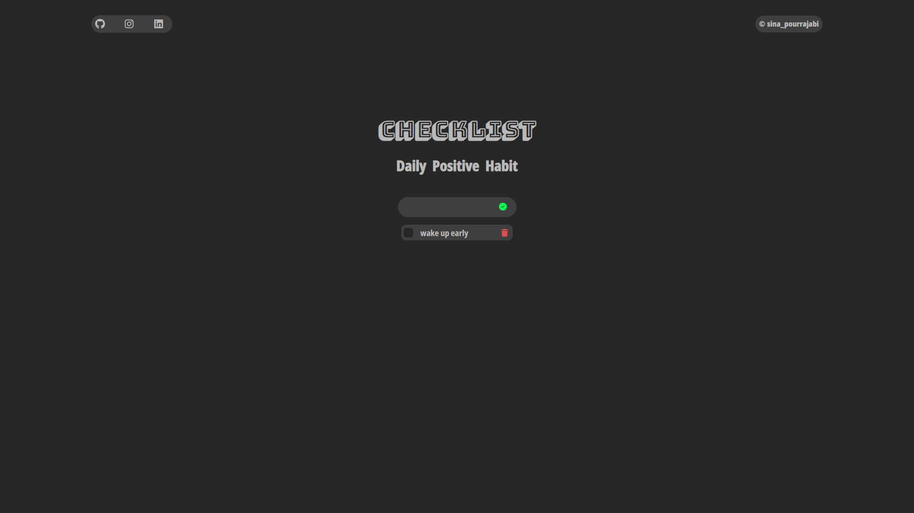

# ✅ Todo App

A simple and responsive **Todo App** built with **HTML, CSS, and JavaScript**.  
Users can add tasks, mark them as completed, and delete them. Input validation and error handling are included for a better user experience.

---

## 🚀 Features
- Add new todos using the **Enter key** or **Add button**  
- Mark todos as **completed** with a checkbox  
- Delete todos with a **trash icon**  
- Input validation (shows error if empty)  
- Error message automatically disappears when user starts typing  
- Responsive design  

---

## 📸 Preview


---

## 🛠️ Technologies Used
- **HTML5**
- **CSS3**
- **JavaScript (ES6)**

---
## ⚡ How to Use
1. Clone this repository:
   ```bash
   git clone https://github.com/SinaPrj-web/todo-app.git
   Open the project folder:

    cd todo-app

    Open index.html in your browser.


📌 Future Improvements

Save todos to localStorage (persist after refresh)

Add edit functionality for todos

👨‍💻 Author

Created by [Sina Pourrajabi] ✨

Feel free to contribute or suggest improvements!